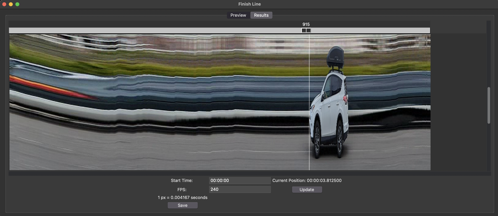

FinishLine takes any video, and transforms it into a time-vs-vertical plot, like what
a photo-finish camera would capture. This of course doesn't give you any more information
than what the original video contains, but it does make it easier to see the order of
finishers across a finish line without needing to step through a video frame by frame.
Additionally, FinishLine makes it easy to see the time at which finishers crossed the 
line.

Dependencies are managed with poetry. Once installed, run main.py to start the program.
Pyinstaller is also included to build executables from the python code.

To use:
1. Load a video file using the "load video" button. The first frame of the video will appear. If the video needs to be rotated, press the "rotate video" buttons to align things.
2. A white line representing the finish line is drawn over the preview. Drag the slider to adjust the position of this line until it covers the finish line in the video. If you need to rotate the line, press the "rotate line" buttons until it is aligned.
3. Select which direction the racers are traveling in with the radio buttons.
4. Press "GO" to create the photo-finish image. The program will hang as it processes, and can take a few moments to finish.
5. Check the results in the "results" tab. 
6. The program does its best to determine the start time of the video (likely in UTC), and the frame rate. If either of these values is incorrect, you can enter corrected numbers for each of them, then press update. 
7. A white line appears at either the far left or right of the result image (depending on which direction of travel was selected). Drag the slider control to adjust the position of the line.
8. The current position of the line will be given as a time. This makes it possible to measure the time at which different finishers cross the line. 
9. Press "save" to save a jpg of the result image.

